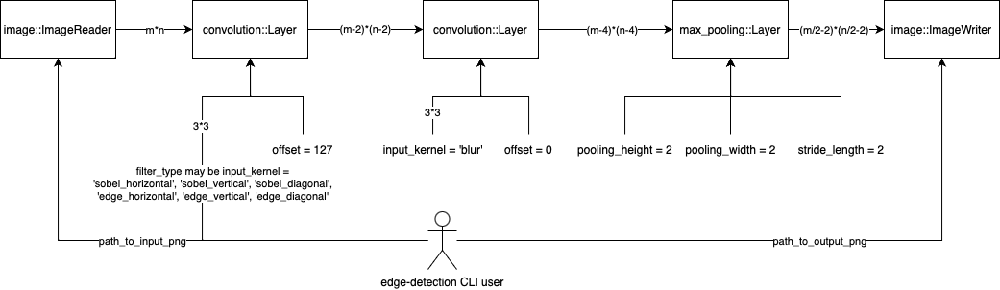

# SystemC Module for Image Edge Detection

As part of a Hardware-Software-Codesign lecture, TSL21 is tasked with achieving edge detection on a PNG picture using convolution and Sobel / Edge kernels.

## Example

This is the example picture:


This is the output when using various kernel filters:

| Filter type        | Output image                                              |
| ------------------ | --------------------------------------------------------- |
| `sobel_horizontal` |  |
| `sobel_vertical`   |      |
| `sobel_diagonal`   |      |
| `edge_horizontal`  |    |
| `edge_vertical`    |        |
| `edge_diagonal`    |        |

## Compiling

The following compiling process assumes a MacOS host. Similar steps must be followed on other hosts. Note that all source code is in the [`src` folder](./src/) and [`include` folder](./include/) shall be added to the include path.

### Prerequisites

- VS Code + C/C++ Extension Pack
- Boost GIL
- libpng
- SystemC 2.3.4
- CMake

### Steps

1. Open this project as a folder in VS Code

   - For Visual Studio, CLion, etc., import this project as a CMake project

2. Configure CMake Project
3. Build all CMake targets

## Usage

Building this project produces the executable / command line tool `edge-detection`. Given [a specific filter type](#example) and a file path to an input PNG image, this command line tool applys the given edge detection filter type to a PNG image and saving the resulting image as a PNG file. By default, this image is saved as `output.png`. The path to the output image may be overwritten.

```
usage: edge-detection <filter> <path/to/input/png> [<path/to/output/png>]

filter:
        sobel_horizontal
        sobel_vertical
        sobel_diagonal
        edge_horizontal
        edge_vertical
        edge_diagonal
```

## Software Architecture



`edge-detection` passes images through a pipeline as shown in the picture above. Each box corresponds to a SystemC module. Refer to their Doxygen documentation for more information. Inside the pipeline, the image is encoded in a separate structure, i.e., [`image::Matrix`](./include/image/Matrix.h). Given a path to an image, [`image::ImageReader`](./include/image/ImageReader.h) reads the image at the designated path, turns it into an `image::Matrix`, and passes it through the pipeline. A [`convolution::Layer`](./include/convolution/Layer.h) applies the [user given filter](./src/bin/edge-detection.cpp) onto the image. This image is, then, blurred by another `convolution::Layer`. Afterwards, [`max_pooling::Layer`](./include/max_pooling/Layer.h) reduces the image dimensions. Finally, the image is saved using [`image::ImageWriter`](./include/image/ImageWriter.h).

## Fragen

**Diskutiere, wie die Entscheidungen bei der Hardware-Software-Partitionierung die Skalierbarkeit eines Systems beeinflussen können.**

Die Skalierbarkeit eines System zeichnet sich durch ihre Fähigkeit aus, gut auf Veränderungen zu reagieren, indem es Ressourcen hinzufügt oder entfernt zur Erfüllung gewisser Anforderungen. Die Hardware-Software-Partionierung kann die Skalierbarkeit hinsichtlich der Ressourcenallokation, Ressourcenverfügbarkeit, Flexibilität, Kosten, Entwicklungsaufwand, Leistung, Durchsatz und der Systemarchitektur beeinflussen.

Reine Hardwareimplementierungen sind bei weitem nicht so flexibel wie Softwarelösungen. Softwarelösungen übertrumpfen reine Hardwarelösungen, wenn auf einer relativ einfachen Art und Weise neue Funktionen zu einem bereits laufenden System hinzugefügt oder entfernt werden müssen, z.B. durch Softwareupdates. Außerdem erfordern Hardwarelösungen oft höhere Kosten und längere Entwicklungszeiten verglichen mit Softwarelösungen.

Während reine Softwarelösungen durch ihre Flexibilität punkten, punkten Hardwareimplementierungen einer bestimmten Funktionalität meist mit besseren Leistungen im Vergleich zu Softwarelösungen. Somit lassen sich in einer heterogenen Systemarchitektur, also Architekturen mit einer nahtlosen Zusammenarbeit zwischen Hardware- und Softwarekomponenten, bestimmte Workloads zwischen den spezialisierten Komponenten aufteilt, welches die Versalität und somit in weitesten Sinne die Skalierbarkeit verbessert.

Zusammengefasst lässt sich sagen, dass Hardwarekomponenten ein System beschleunigen, jedoch u. U. die Skalierbarkeit behindern, weil sie nachträglich schwer zu verändern sind oder weil ihre Entwicklung hohe Kosten und lange Entwicklungszeiten mit sich ziehen.

**Erkläre, wie die Wahl unterschiedlicher Debugging-Strategien die Effizienz der Fehlerbehebung in SystemC beeinflussen kann.**

Im folgenden wird zwischen den folgenden Debugmethoden unterschieden: Printf-Debugging, Nutzung eines Debuggers wie z.B. GDB oder Simulationstracing.

Das Debuggen mit Printf zählt zu den einfachsten Methoden des Debuggings. Während der Programmausführung werden Lognachrichten oder Konsolenausgaben mit `printf` ausgegeben, welche den Status der Programmausführung wiederspiegeln. Verglichen mit anderen Debuggingmethoden, welche in den folgenden Absätzen beschrieben werden, ist diese Art von Debugging einfach umzusetzen und auch für Laien verständlich. Jedoch gewährt diese Debugmethode nur beschränkt oder nur unter großen Mühen Einsicht auf den Programmfluss. So müsste man eine Unzahl an `printf`s in einem Programm einsetzen. Außerdem muss beachtet werden, dass diese `printf`s möglicherweise unerwünscht sind in der Produktionsversion einer Software.

Mithilfe von Debug Flags lassen sich in C++ solche `printf`s mit Debug Flags aktivieren. Tester könnten mit diesen Flags außerdem "Assertions" definieren. Solche `assert` Anweisungen evaluieren gewisse Wahrheitsbedingungen. Wenn diese Bedingungen nicht erfüllt werden, wird der Programmfluss mit einem Fehler abgebrochen. Ähnlich wie `printf` Debugging profitieren Assertions von der einfachen Umsetzbarkeit. Aber bei deren Benutzung muss man beachten, dass diese Assertions nur beim Setzen der entsprechenden Debug Flag aktiviert werden. Wenn sie deaktiviert sind, werden die korrespondierenden Wahrheitsbedingungen ignoriert, auch wenn sie als falsch evaluieren.

Eine alternative Methode zum `printf` Debugging ist die Nutzung eines Debuggers, wie z.B. GDB. Ein Debugger bietet umfangreiche Einsichten in einen Programmablauf. Bspw. ist es möglich, ein Programm Zeile für Zeile ausführen zu lassen. Mithilfe der Debugkonsole lassen sich Ausdrücke an einer bestimmten Programmstelle, z. B. in der Hauptfunktion, evaluieren. Allerdings sind für die Nutzung eines Debugger häufig komplexe Entwicklungsumgebungen notwendig.

Speziell für SystemC können Entwickler sogenannte "Trace Files" aufnehmen. In diesen Dateien werden die Signale von SystemC-Modulen aufgezeichnet. Somit lässt sich Hardware simulieren und Trace Files bieten Einsicht in Signale innerhalb der simulierten Hardware.

Die genannten Debugmethoden geben wertvolle Einsichten in einen Programmablauf. Die Abwesenheit solcher Informationen kann das Finden von Softwaredefekten erheblich erschweren insbesondere innerhalb komplexen großen Codebases. Dies kann zur kompletten Ratlosigkeit während des Debuggings führen, was zu eine ineffizienten Fehlerbehebung führt. Daher helfen die oben genannten Debugmethoden zum besseren Verständnis des Programmablaufs, womit zeiteffizienter Fehler behoben werden können.

## Resources

- https://deeplizard.com/learn/video/ZjM_XQa5s6s
- https://github.com/prateeksawhney97/Canny-Edge-Detection-Lane-Lines/blob/master/Canny.py
- https://www.lucidchart.com/blog/de/was-bedeutet-skalierbarkeit-fuer-systeme-und-dienste#:~:text=Ein%20skalierbares%20IT%2DSystem%20zeichnet,den%20Anforderungen%20gerecht%20zu%20werden.
- https://www.learnsystemc.com/basic/trace
