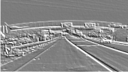

# SystemC Module for Image Edge Detection

As part of a Hardware-Software-Codesign lecture, TSL21 is tasked with achieving edge detection on a PNG picture using convolution and Sobel / Edge kernels.

This is the example picture:

This is the output when using the Sobel kernel for detecting vertical edges:

## Resources

- https://deeplizard.com/learn/video/ZjM_XQa5s6s
- https://github.com/prateeksawhney97/Canny-Edge-Detection-Lane-Lines/blob/master/Canny.py
