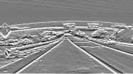

# SystemC Module for Image Edge Detection

As part of a Hardware-Software-Codesign lecture, TSL21 is tasked with achieving edge detection on a PNG picture using convolution and Sobel / Edge kernels.

This is the example picture:

This is the output when using various kernel filters:

| Filter argument    | Output image                                              |
| ------------------ | --------------------------------------------------------- |
| `sobel_horizontal` |  |
| `sobel_vertical`   |      |
| `sobel_diagonal`   |      |
| `edge_horizontal`  |    |
| `edge_vertical`    |        |
| `edge_diagonal`    |        |

## Resources

- https://deeplizard.com/learn/video/ZjM_XQa5s6s
- https://github.com/prateeksawhney97/Canny-Edge-Detection-Lane-Lines/blob/master/Canny.py
